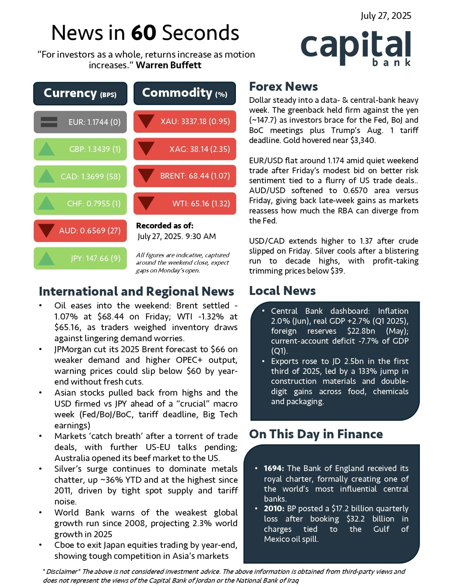

# News in 60 Seconds

A daily financial newsletter that writes and sends itself.

Every weekday morning at 8:30 Amman time, the program pulls live FX and
commodity prices, reads the news, writes a one-page briefing, and formats it on a PDF.



```
market.py     →  yfinance: 6 FX pairs + gold, silver, Brent, WTI
                 computes the day's move, decides green/red/grey
                       ↓
research.py   →  Claude + web search: reads the last 24-48h, writes the copy
                       ↓
render.py     →  Jinja2 → HTML → headless Chromium → a 612×792pt PDF
                 measures the result. 
                       ↓
mailer.py     →  Gmail SMTP, PDF attached
```

If any step can't do its job properly, the whole run stops and emails a
traceback instead. 

## Keeping it on one page

1. **Word budgets in the prompt.** Every section has a hard limit
3. **A validator that counts words afterwards** and re-asks Claude with the
   specific overruns.
4. **A fit check in the renderer.** After laying the page out, it measures where
   the content actually ends. If anything crosses 762pt it re-renders at a
   tighter setting and tries again. 

## Setting it up

Python 3.11+ due to Pylance. 

```bash
python -m venv .venv && source .venv/Scripts/activate
pip install -r requirements.txt
playwright install chromium
```

**See it render** 

```bash
python scripts/preview.py
```

**Environment variables** 

```bash
export ANTHROPIC_API_KEY=sk-ant-...
export GMAIL_ADDRESS=you@gmail.com
export GMAIL_APP_PASSWORD=...        # 16 chars, from Google, not your password
```

## Running it

```bash
python src/main.py --dry-run     # build the PDF, don't send it
python src/main.py               # for real
python src/main.py --force       # ignore the Sun–Thu schedule
python src/main.py --date 2026-07-30
```

It only publishes Sunday through Thursday, because that's Jordan's working week.

## Layout of the repo

```
config.yaml          
recipients.yaml      
src/
  market.py          
  research.py        
  render.py          
  mailer.py          
  main.py            
templates/
  newsletter.html.j2 
scripts/
  preview.py         
  pack_fonts.py      
  unpack_fonts.py    
tests/
  test_against_sample.py    
  fixture_original_issue.py 
reference/          
```
